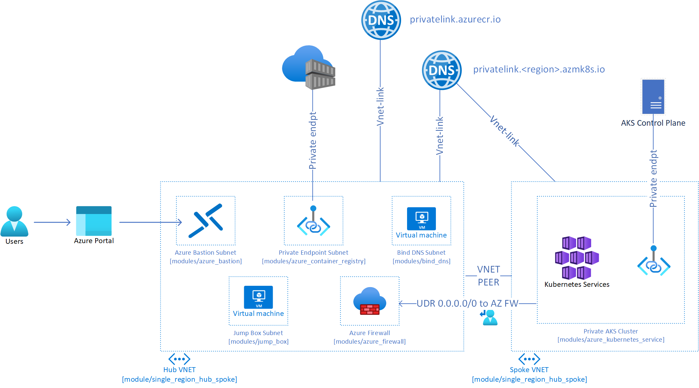

# Overview 
The following project demonstrates deployment of a private AKS cluster within a hub-spoke model with custom DNS. It consists of: 
1. Hub VNET with:
    1. Azure Bastion - Used SSH into BIND/Jump Box VMs
    2. Azure Firewall - Used for AKS Egress Filtering
    3. BIND DNS - Used as the DNS for Spoke VNET, Forwards to 168.63.129.16 for Private Endpoint resolution
    4. Private Endpoint Subnet for ACR/other shared resources
    5. Azure Private DNS for Private Endpoints [ACR, AKS]
2. Spoke VNET with:
    1. VNET Custom DNS Servers pointed to BIND DNS
    2. Private AKS Cluster with UDR to Azure Firewall for Egress

# Module Design Principles:
As there are multiple ways to create TF modules and instantiate environment instances. We structured the repository in the following way: 
1. Single resources and their dependencies are grouped into a module 
2. Architecture templates are grouped into a module
3. There is only 2 degrees of nesting max: root (main.tf) --> module --> module

# Build and Environment Dependencies 
1. Terraform execution environment should be within a linux context
2. jq lib [sudo apt-get install jq], Azure CLI needed
3. Assumption is that you leveraged the azure cli login auth method within your dev environment, there needs to be additional code modifications for deploying this via Azure DevOps/other build utilities (dns-zone-link.sh and aks module needs to be modified)
4. Ensure you edit the bind_install.sh to reference your own blob storage location for config file storage and update named.conf.options allowedclients list. 
5. Generate PEM keys for VMs and AKS

# Generate SSH Keys for VM or AKS Access
To generate an ssh key pair for VM/AKS access, you can leverage the following command: 
ssh-keygen -m PEM -t rsa -b 4096 -f "key name"
Make sure to reference the right pem key location within your tfvars 

# Azure Bastion Host 
Azure Bastion host will be leveraged to SSH into VMs within the environment [ex. DNS Server, Jump Boxes]. Unfortunately, this can not be extend to SSH into worker-nodes on AKS clusters due to a known issue: https://github.com/Azure/AKS/issues/1854 